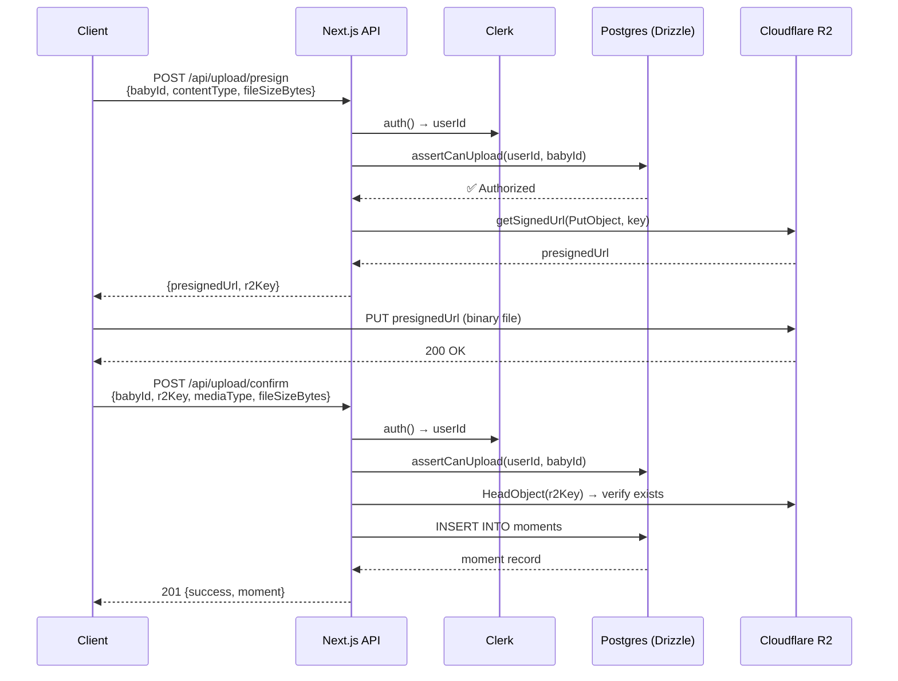

# Secure Direct-to-R2 Client Upload Backend

Implement a two-phase presigned URL upload flow: the client requests a presigned `PUT` URL from our API (after permission checks), uploads the file directly to R2, then confirms the upload so a `moments` record is created in Postgres.

## User Review Required

> [!IMPORTANT]
> **Schema Gap — `accessShares` table:** The current `accessShares` table identifies shared users by `invitedEmail`, not `userId`. For the permission check to work efficiently (comparing against the authenticated Clerk `userId`), we have two options:
> 1. **Add a `userId` column** to `accessShares` (populated when the invited user accepts the share / signs up) — **recommended**.
> 2. **Join through `users.email`** at query time (slower, couples auth identity to email which can change).
>
> The plan below assumes **Option 1**. Please confirm or redirect.

> [!WARNING]
> **Schema Gap — `moments` table:** The current `moments` table is missing `mediaType` (text) and `fileSizeBytes` (integer) columns that your requirements call for. The plan includes a migration to add them.

> [!CAUTION]
> **Clerk is not yet integrated.** The project currently has no `@clerk/nextjs` dependency and no middleware. The plan includes installing it and wiring up `auth()`. If you want to handle Clerk setup separately, let me know and I'll stub the auth call.

---

## Proposed Changes

### 1. Schema Migration

#### [MODIFY] [schema.ts](file:///c:/JOBS/BabyJourney/baby-journey/app/db/schema.ts)

Add two fields to `moments`:
```diff
 export const moments = pgTable("moments", {
   ...
+  mediaType: text("media_type").notNull(),       // e.g. "image/jpeg", "video/mp4"
+  fileSizeBytes: integer("file_size_bytes").notNull(),
   ...
 });
```

Add `userId` field to `accessShares`:
```diff
 export const accessShares = pgTable("access_shares", {
   ...
+  userId: text("user_id").references(() => users.id), // Populated on share acceptance
   ...
 });
```

After editing, run `npx drizzle-kit generate` then `npx drizzle-kit push` (or `migrate`) to apply.

---

### 2. Clerk Integration (if not handled separately)

#### [NEW] [middleware.ts](file:///c:/JOBS/BabyJourney/baby-journey/middleware.ts)

Install `@clerk/nextjs`, create root middleware using `clerkMiddleware()` to protect API routes. Public routes (landing page, etc.) will be explicitly declared.

---

### 3. Permission Utility

#### [NEW] [permissions.ts](file:///c:/JOBS/BabyJourney/baby-journey/app/lib/permissions.ts)

A reusable async function `assertCanUpload(userId: string, babyId: string)` that:

1. Queries `babies` where `id = babyId AND ownerId = userId`. If found → **authorized** (owner).
2. Else queries `accessShares` where `babyId = babyId AND userId = userId AND role = 'editor'`. If found → **authorized** (co-parent/grandparent with edit rights).
3. Otherwise → throws/returns `403 Forbidden`.

**Drizzle query logic:**
```ts
import { db } from "@/app/db";
import { babies, accessShares } from "@/app/db/schema";
import { eq, and } from "drizzle-orm";

export async function assertCanUpload(userId: string, babyId: string): Promise<boolean> {
  // Check 1: Is the user the baby's owner?
  const baby = await db.query.babies.findFirst({
    where: and(eq(babies.id, babyId), eq(babies.ownerId, userId)),
  });
  if (baby) return true;

  // Check 2: Does the user have an 'editor' access share?
  const share = await db.query.accessShares.findFirst({
    where: and(
      eq(accessShares.babyId, babyId),
      eq(accessShares.userId, userId),
      eq(accessShares.role, "editor"),
    ),
  });
  if (share) return true;

  return false; // No permission
}
```

---

### 4. Presigned URL Endpoint

#### [NEW] [route.ts](file:///c:/JOBS/BabyJourney/baby-journey/app/api/upload/presign/route.ts)

**`POST /api/upload/presign`**

| Field | Source | Description |
|---|---|---|
| `babyId` | Request body (JSON) | UUID of the baby to upload media for |
| `contentType` | Request body (JSON) | MIME type (e.g. `image/jpeg`) |
| `fileSizeBytes` | Request body (JSON) | File size for record-keeping |

**Flow:**
1. Extract `userId` from `auth()` (Clerk). Return `401` if unauthenticated.
2. Validate input with Zod (babyId is UUID, contentType is allowlisted, fileSizeBytes is positive integer).
3. Call `assertCanUpload(userId, babyId)`. Return `403` if false.
4. Generate a randomized R2 key: `{babyId}/{crypto.randomUUID()}.{extension}`.
5. Create a presigned `PutObject` URL using `@aws-sdk/s3-request-presigner`:
   ```ts
   import { getSignedUrl } from "@aws-sdk/s3-request-presigner";
   import { PutObjectCommand } from "@aws-sdk/client-s3";
   import { r2 } from "@/app/lib/r2";

   const command = new PutObjectCommand({
     Bucket: process.env.R2_BUCKET_NAME!,
     Key: r2Key,
     ContentType: contentType,
   });
   const presignedUrl = await getSignedUrl(r2, command, { expiresIn: 300 }); // 5 min
   ```
6. Return `{ presignedUrl, r2Key }` to the client.

> [!NOTE]
> The presigned URL is scoped to the exact `Key` and `ContentType`. The client performs `fetch(presignedUrl, { method: "PUT", body: file, headers: { "Content-Type": contentType } })`.

---

### 5. Upload Confirmation Endpoint

#### [NEW] [route.ts](file:///c:/JOBS/BabyJourney/baby-journey/app/api/upload/confirm/route.ts)

**`POST /api/upload/confirm`**

| Field | Source | Description |
|---|---|---|
| `babyId` | Request body (JSON) | Same `babyId` from the presign step |
| `r2Key` | Request body (JSON) | The key returned from the presign step |
| `mediaType` | Request body (JSON) | MIME type (`image/jpeg`, `video/mp4`, etc.) |
| `fileSizeBytes` | Request body (JSON) | Actual file size in bytes |
| `caption` | Request body (JSON) | Optional text caption |

**Flow:**
1. Extract `userId` from `auth()`. Return `401` if unauthenticated.
2. Validate input with Zod.
3. Call `assertCanUpload(userId, babyId)`. Return `403` if false.
4. **(Integrity check)** Verify the object actually exists in R2 by issuing a `HeadObjectCommand` against the `r2Key`. Return `400` if the object doesn't exist.
5. Insert into `moments`:
   ```ts
   await db.insert(moments).values({
     babyId,
     userId,
     r2Key,
     mediaType,
     fileSizeBytes,
     caption: caption || null,
   });
   ```
6. Return `201 { success: true, moment }`.

---

### 6. Supporting Config & Types

#### [MODIFY] [r2.ts](file:///c:/JOBS/BabyJourney/baby-journey/app/lib/r2.ts)

No changes needed — the existing `S3Client` singleton already uses the correct R2 endpoint and credentials. The presigner imports this directly.

#### Allowed MIME Types (defined as a const in the presign route or a shared `lib/constants.ts`):

```ts
export const ALLOWED_MEDIA_TYPES = [
  "image/jpeg", "image/png", "image/webp", "image/heic",
  "video/mp4", "video/quicktime", "video/webm",
] as const;
```

---

## Architecture Diagram



---

## File Summary

| Action | File | Purpose |
|---|---|---|
| MODIFY | [schema.ts](file:///c:/JOBS/BabyJourney/baby-journey/app/db/schema.ts) | Add `mediaType`, `fileSizeBytes` to moments; `userId` to accessShares |
| NEW | [middleware.ts](file:///c:/JOBS/BabyJourney/baby-journey/middleware.ts) | Clerk auth middleware |
| NEW | [permissions.ts](file:///c:/JOBS/BabyJourney/baby-journey/app/lib/permissions.ts) | `assertCanUpload()` authorization logic |
| NEW | [presign/route.ts](file:///c:/JOBS/BabyJourney/baby-journey/app/api/upload/presign/route.ts) | Presigned URL generation endpoint |
| NEW | [confirm/route.ts](file:///c:/JOBS/BabyJourney/baby-journey/app/api/upload/confirm/route.ts) | Post-upload DB insert endpoint |

---

## Verification Plan

### Automated Tests
No test framework (Jest/Vitest) is currently set up in the project, so automated unit tests would require additional scaffolding. I recommend deferring test setup to a follow-up task unless you'd like me to add it now.

### Manual Verification
1. **Build check:** Run `npm run build` after all changes to ensure no TypeScript errors.
2. **Schema migration:** Run `npx drizzle-kit generate` and `npx drizzle-kit push` to apply the new columns, then verify by querying the DB directly.
3. **Presign endpoint (curl):**
   ```bash
   curl -X POST http://localhost:3000/api/upload/presign \
     -H "Content-Type: application/json" \
     -H "Authorization: Bearer <clerk-session-token>" \
     -d '{"babyId":"<uuid>","contentType":"image/jpeg","fileSizeBytes":102400}'
   ```
   - Expect `200` with `{ presignedUrl, r2Key }` if the user owns the baby.
   - Expect `403` for an unauthorized user.
4. **R2 upload (curl):** Use the returned `presignedUrl` to `PUT` a real file:
   ```bash
   curl -X PUT "<presignedUrl>" \
     -H "Content-Type: image/jpeg" \
     --data-binary @test-photo.jpg
   ```
   - Expect `200` from R2.
5. **Confirm endpoint (curl):**
   ```bash
   curl -X POST http://localhost:3000/api/upload/confirm \
     -H "Content-Type: application/json" \
     -H "Authorization: Bearer <clerk-session-token>" \
     -d '{"babyId":"<uuid>","r2Key":"<key>","mediaType":"image/jpeg","fileSizeBytes":102400}'
   ```
   - Expect `201` and a new row in the `moments` table.
